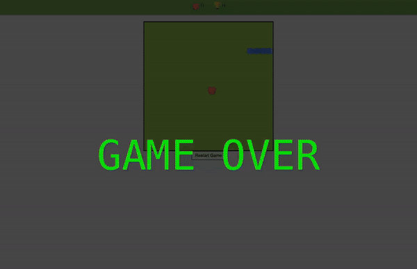

# Snake Game Canvas

- [Description](#description)
- [Features](#features)
- [Installation](#installation)
- [Usage](#usage)
- [Demo](#demo)
- [Contributing](#contributing)
- [License](#license)

## Description

Snake Game Canvas is a simple implementation of the classic Snake game using HTML5 canvas and JavaScript.

## Features

- Classic Snake gameplay experience
- Responsive design suitable for various screen sizes
- Simple and intuitive controls
- Game Over message display
- Modular code structure for easy maintenance and customization

## Installation

To run the Snake Game Canvas locally, follow these steps:

1. Clone this repository to your local machine.
2. Open the `index.html` file in your web browser.

## Usage

Once the game is running, use the arrow keys on your keyboard to control the snake’s direction. Try to eat as much food as possible without running into the walls or yourself.

## Demo

You can see a **preview** of the gameplay below:

*(Optionally add a live link or additional screenshots if you have them.)*

## Contributing

Contributions to Snake Game Canvas are welcome! Here’s how you can contribute:

1. Fork the repository.
2. Make your changes.
3. Submit a pull request.

## License

Snake Game Canvas is licensed under the MIT License. See [LICENSE](LICENSE) for more information.
